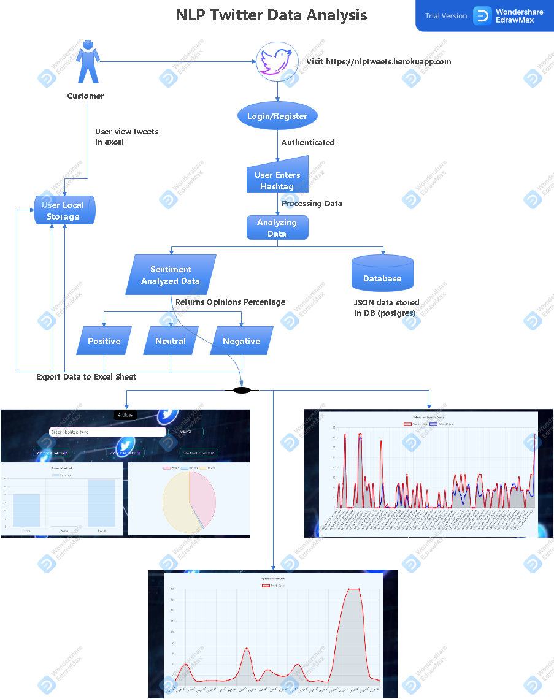

<div align='center'>


</div>
    
# Twitter Data Analysis

This project is about analyzing and visualizing sentiments on Twitter Real-Time data based on the Hashtags.
<br/>

We have developed a Full-Stack web app for the above statement using Django Framework so that the business users or anyone will sign in or signup to our web app then they can visualize sentiments on specific Hashtags.

## Tech Stack

**Client:** HTML5, CSS3, JavaScript, Jquery, Bootstrap4

**Server:** Django, Postgres, Twitter API


## Features

- Authentication via Different Social Media Platforms
- Opinion Mining
- Advanced Visualizations
- Exporting Tweets to Excel Sheet

  
## Badges

<br/>

[](https://github.com/jjnanthakumar/D2-Twitter-Analysis-Project/blob/main/LICENSE)
[](https://github.com/jjnanthakumar/D2-Twitter-Analysis-Project/tree/main/Source%20Code)

## Architecture Diagram
<br/>


<br/>

## API Reference
Replace all your twitter dev app credentials below in [twitter.py](source%20code/OpinionMining/twitter.py) file

```python
consumer_key = 'YOUR CONSUMER KEY'
consumer_secret = 'YOUR CONSUMER SECRET'
access_token = 'YOUR ACCESS TOKEN'
access_token_secret = 'YOUR ACCESS SECRET'
```

Get your Access tokens from [here](https://developer.twitter.com/en/portal/apps/new)

  
## Deployment

To deploy this project,

Deployment Steps [here](DeploymentSteps.md)

  
## Demo

Insert gif or link to demo

  
## Run Locally

Clone the project

```bash
  git clone https://github.com/jjnanthakumar/D2-Twitter-Analysis-Project.git
```

Go to the project directory

```bash
  cd D2-Twitter-Analysis-Project
```

Install dependencies

```bash
  pip install -r requirements.txt
```

Start the server

```bash
  python manage.py runserver
```

Then visit https://localhost:8000 in your local machine.

  
## Feedback

If you have any feedback, please reach out to us at nlptweets@gmail.com or visit [here](https://nlptweets.herokuapp.com/contact)

  
## Support

For support, email nlptweets@gmail.com or join our Discord Server.

  
## Authors

- [@jjnanthakumar](https://github.com/jjnanthakumar)
- [@praveen](https://github.com/praveen2900)
- [@nirmal](https://github.com/nirmalkumar12720)
  